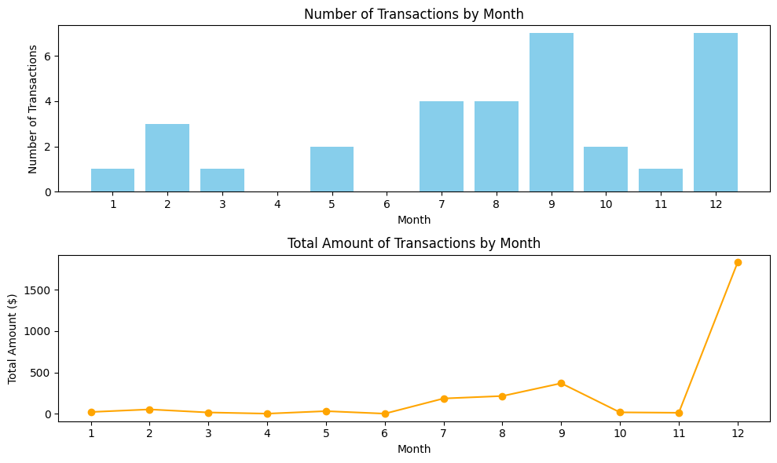
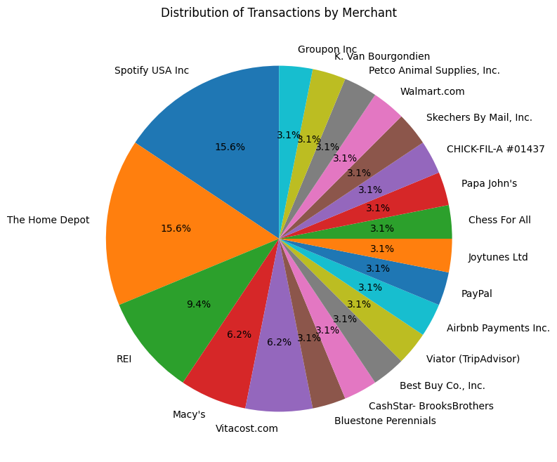
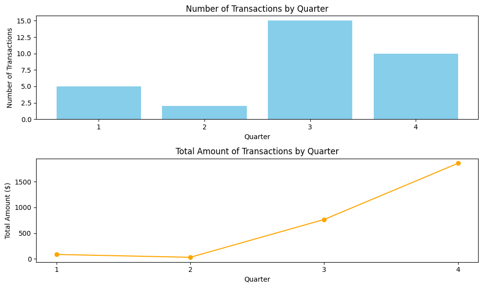
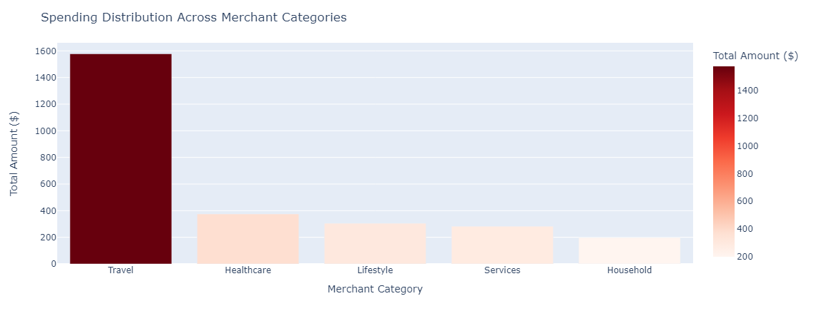
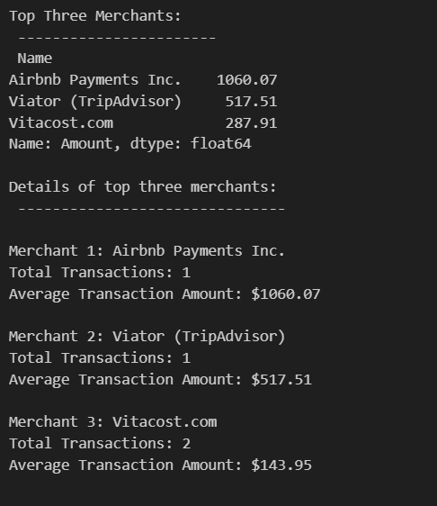
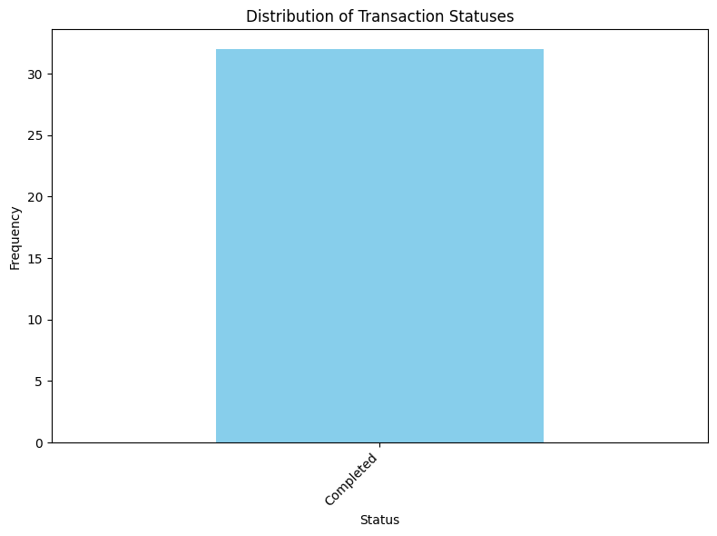
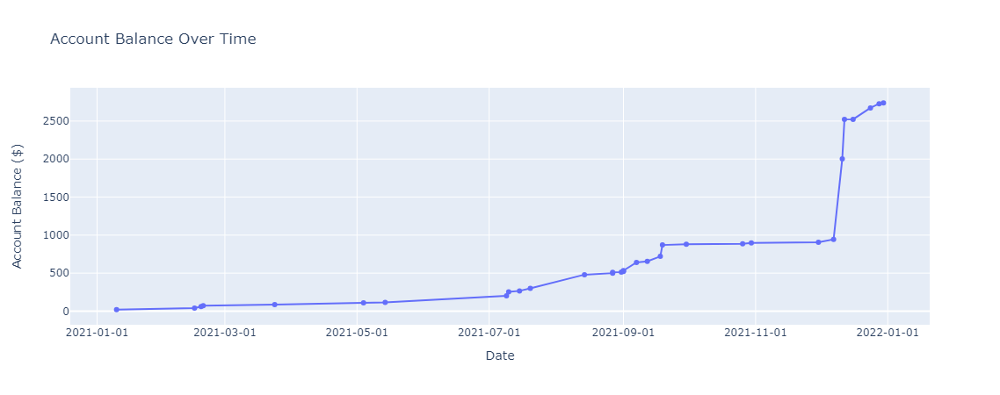

# PaypalTransactionsDataAnalysis2021
## OVERVIEW
The overview of the project "2021 PayPal Transactions Data Analysis: Categorizing and Analyzing Spending Patterns" is to gain insights into the spending habits and patterns of a household or individual throughout the year 2021 based on PayPal transaction data. By categorizing transactions into meaningful groups such as services, healthcare, travel, lifestyle, and household expenses, the project aims to provide a comprehensive overview of where and how money was spent over the course of the year 2021.
## Data Source
-  My family Paypal transaction data for the year 2021 (2021_PAYPAL.CSV)
## Data Processing and Data Transformation
- Data Cleaning:
    - Handling Missing Values: Identifying and dealing with any missing or null values in the dataset. 
    - Removing Unwanted Columns: Removing columns that are unnecessary or irrelevant for the analysis
- Data Transformation:
    - Categorization: Assigning categories to transactions based on merchant names to classify spending into distinct categories such as services, healthcare, travel, lifestyle, and household expenses.
## Replicating the Analysis
 There is one  jupyter notebook, paypal_2021_demo.ipynb
 ## Getting Started
### To replicate this project:

1. Clone the repository to your machine:
    ```bash
    git clone https://github.com/ElizabethGLiz/PaypalTransactionsDataAnalysis2021.git
    ```
2. Create and activate a virtual environment, and install required packages from 'requirements.txt':
- **Linux/Mac:**
  ```bash
  python3 -m venv venv
  source venv/bin/activate
  pip install -r requirements.txt
  ```
- **GitBash:**
  ```bash
  python -m venv venv
  source venv/Scripts/activate
  pip install -r requirements.txt
  ```
3. Once complete, be sure to deactivate:
    ```
    deactivate
      ```
4. Ensure the data file have successfully moved to the main project directory before running the  analysis notebook.
5. Run the notebook    

## Data Visualizations and Analysis
 - Visualize how the number and total amount of transactions vary over different months throughout the year 2021.
 
 - Visualize the distribution of transaction counts by merchant names in a pie chart.
 
 - Visualize how the number and total amount of transactions vary over different quarters throughout the year 2021.
 
 - Visualize the distribution of spending across different merchant categories.
 
 - Determine which merchants you spent the most with during the year and analyze your spending behavior with each merchant
 
 - Visualize the distribution of transaction statuses.
 
 - Generate a line graph showing how your account balance changed over time as a result of the transactions.
 

 ## Summary
 The project "2021 PayPal Transactions Data Analysis: Categorizing and Analyzing Spending Patterns" focuses on gaining insights into spending habits and patterns throughout the year 2021 using family PayPal transaction data. By categorizing transactions into distinct groups such as services, healthcare, travel, lifestyle, and household expenses, the project aims to provide a comprehensive overview of spending behaviors. Through data processing, transformation, and visualization techniques, the project analyzes transaction trends over time, spending patterns by merchant category, top merchants by spending, transaction status distribution, and account balance trends. Ultimately, the project aims to empower individuals or households with valuable insights to make informed financial decisions and optimize financial management practices.


